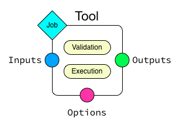
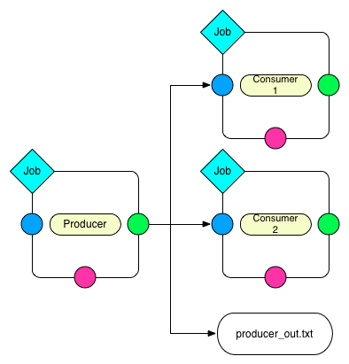

.. _tools_and_pipelines:

Tools and Pipelines
===================
The essential parts of the JIP system are *tools* and *pipelines*. Tools 
represent the smallest unit in the system and allow you to implement 
independent executable blocks. Pipelines are *directed acyclic graphs* that
consist of a set of nodes representing tool executions and edges representing
the dependencies between these executions.

.. _jip_tools:

Tools
-----
In JIP, *tools* are small executable units that carry meta information
to describe the actual execution and its options as well as a way to 
validate and update the tools' state.

    
    A single tool consists of the following essential parts. The tools
    ``options`` are divided into ``Inputs``, ``Outputs``, and ``Options``.
    The tool itself consists of an optional validation block and an execution
    block. In addition, a tool has a ``Job`` association that covers the basic
    execution environment.

The simplest form of a tool consist of the following parts:

    Options
        Options are a way to express the tools input and output capabilities and
        other options. ``Inputs`` are usually files or data streams that are
        read by the tool. ``Outputs``, as the name suggests, cover files and
        data streams created by a tool. Other ``Options`` can also be defined.
        Please note that :ref:`input and output <tool_io>` options are treated
        specially when a tool is executed.

    Execution block
        A single tool contains one execution block that either executes a
        command script or that creates and returns a pipeline. Command scripts
        are, by default, implemented in ``bash`` but you can switch the 
        interpreter and write the command in any interpreted language. On the 
        other hand, an execution block can also create a *pipeline* which then
        will be incorporated into the overall execution graph.

    Init block
        A tool instance can provide an ``init`` block that will be called once,
        when the tool is loaded. ``init`` implementations are not allowed to act
        on option values, but, can be used to setup and initialize the tool
        instance itself. Use this block, for example, to add :ref:`dynamic
        options <dynamic_options>` to the tool instance. Please note that the
        setup blocks have to be implemented in `python` and there is currently
        no way to change the interpreter for those blocks.

    Setup block
        A tool instance can provide a ``setup`` block that will be called
        before the options are finalized and rendered. The tool options are 
        set when this block is called and you can use it, for example, to 
        implement some logic on the option values. When this block is executed,
        the options are not yet rendered. That means you are allowed to 
        set option values to template strings.
      
    Validation block
        In addition to the actual execution, a *tool* implementation can
        extend its default validation. By default, the system ensures that all
        specified input files exists. You can add more checks in the validation
        block. Please note that the validation blocks have to be implemented in
        `python` and there is currently no way to change the interpreter for
        those blocks.

        The validation block also is the place to modify the tools job 
        environment in case you don't want to set parameters from the command
        line at execution or submission time.

JIP currently supports two ways to implement tools and pipelines. JIP
:ref:`scripts <jip_tool_scripts>` and python :ref:`modules with decorators
<jip_tool_modules>`.

.. _jip_tool_scripts:

Scripts
^^^^^^^
One way to implement your tools and pipelines is using JIP *scripts*. The 
system can be executed as an interpreter, hence you can start your scripts
with ``#!/usr/bin/env jip``, make them executable and run them directly. The
interpreter detects ``--`` in the command line and uses it to separate 
arguments. Everything after the ``--`` is passed as an argument to the
JIP interpreter rather than your tool.

Basic JIP scripts can be used to implement both tools & pipeline, and they provide
a way to define the JIP options directly in the script. A script usually 
contains the following blocks:

    Documentation, help and options
        A jip script starts with a documentation and help block that 
        contains also the option definition. We use the great `docopt 
        <http://docopt.org>`_ library to parse your option definitions. 

    Blocks for ``init``, ``setup``, ``validate`` and execution
        You can open a block in a JIP script using ``#%begin <blocktype> 
        <args>`` and close it with ``#%end``. Nested blocks are currently 
        not supported. 

Documentation, help, and options
********************************
An essential part of any script, independent of the context, is documentation
and command line options. Unfortunately, this is often neglected and you end
up with a set of script files that you understand while you write and use
them first, but if you have to come back to those *things* after some time,
you are often lost. The easiest way is to try to document both your script
and the command line options, then it takes in a meaningful way. The downside
of this is that your initial small script that consists of just a few lines
of code will get filled with a lot of code responsible for parsing your command line
options.

The *docopt* library tries to tackle the problem and is able to parse option
definitions that are given in a *POSIX* compliant way. JIP makes heavy use
of this library and allows you to specify the option definition in a *POSIX*
style way and then to extract the available meta-information. Here is one of the
most simple scripts you can write::

    #!/usr/bin/env jip
    # Send greetings
    #
    # usage:
    #   greeting <name>

    echo "Hello ${name}"

Make the script executable, ``chmod +x greetings.jip`` and run it::

    $> ./greetings.jip Joe
    Hello Joe

You can see that you have access to the parsed options directly in your script.
In addition, the ``-h|--help`` option is in place and will print the 
documentation.

We decided to use a slightly modified version of the `docopt
<http://docopt.org>`_ library and to force you to write documentation, at least
for your options. It might sound harsh and it is a hard constrain, but in order
to write reusable tools, you have to provide some sort of definition of your
tools options. It turns out, writing options is rather straight
forward, you get documentation for your tools and the JIP system can extract
the information about your tools options. Here is a larger example
where we actually define different kinds of options::

    #!/usr/bin/env jip
    # Wow, accessing arguments without parsing them is great!
    #
    # Usage:
    #     my_tool -i <input>... [-o <output>] [-b] 
    #
    # Inputs:
    #     -i, --input <input>    List of input files
    # 
    # Outputs:
    #     -o, --output <output>  The output file
    #                            [default: stdout]
    #
    # Options:
    #     -b, --boolean          A boolean flag

    echo "INPUT: ${input}"
    echo "OUTPUT: ${output}"
    echo "BOOLEAN? ${boolean|arg("yes")|else("no")}"

A single JIP tool always has a set of options (see 
:class:`~jip.options.Options` for the underlying API). The options are divided 
into three groups:

    ``Inputs``
        Input options usually are options that take a file or a list of files.
        These files, if specified, have to be present at execution time.

    ``Outputs``
        Output options are all options that define files that are created by
        a tool run. These are of particular importance when it comes to
        job failures and cleanups. In addition, you might not always be able
        to expose all your outputs through the command line interfaces. 
        For example, your tool might just take a prefix and then create a
        set of files based on the specified prefix. These cases can be
        handled using :ref:`dynamic options <dynamic_options>`.

    ``Options``
        All options that are not ``Inputs`` or ``Outputs`` fall into this 
        group.

.. note:: Note that you have to indicate the ability of a tool to read form 
          ``stdin`` or write to ``stdout`` explicitly. For this, set the 
          options default value to ``stdin`` or ``stdout`` respectively.

When options are used to build pipelines, it is important to indicate a tools
default input and output options. This is done using the definition order. In
case you have more than one input or output option, the first one in the list
is marked as the default input/output. Options that accept streams always take
precedence and are always defined as the default options for input or output.
       

Execution blocks
****************
JIP script must contain exactly one, non-empty, execution block. There are 
two types of execution blocks:

    command block (``#%begin command [<interpreter>]``)
        Command blocks execute their block content with a specified 
        interpreter. The block content is a JIP template and you have 
        access to the full context. The command block takes a single
        argument, which defines the interpreter that will be used to run
        the blocks content. The default interpreter is *bash*.

    pipeline block (``#%begin pipeline``)
        Pipeline blocks are written in *python* and allow you to define a
        pipeline graph that will then be expanded and executed.

All execution blocks can be explicitly opened with ``#%begin command`` or
``#%begin pipeline`` and can be closed by ``#%end``. If no block is opened
explicitly, a *bash* command block is created implicitly.

Init blocks
************
A script or tool definition can specify a ``init`` block in order to create 
more options that are registered with the tool. Please note that the init
blocks are evaluated once, just after the tool is created. That means that the 
option values are not yet set and you can not implement any logical decisions
based on the option values. You can, however, use the init block to 
add more options to a tool. For example::

    #%begin init
    add_output('output', '${input|name|ext}.out')
    #%end

Here we add a new output option and set its value as a template that uses the
tools ``input`` option. This is valid as the options value will be evaluated
later, when the input option is set.

Setup blocks
************
Setup blocks are executed before the options values are rendered and can be
used to change options based on their values. Because template strings are
not yet rendered, you can set the template strings as values. For example::

    #%begin setup
    if options['threads'].get(int) > 1:
        options['parallel_mode'] = True
    #%end

Validation blocks
*****************
In addition to the command execution or pipeline definition, a script can
contain a single ``validate`` block::

    #%begin validate
    # check a file
    check_file('input')
    
    import datetime
    day = datetime.date.today().strftime("%A")
    if day == 'Monday':
        validation_error("I don't like Mondays")
    #%end

All validation blocks are written in *python* and the :ref:`context 
<python_context>` exposes a set of helper functions to perform checks on files
and raises arbitrary validation errors. See :ref:`Validation <validation>` for
more about tool validation.

The execution environment
*************************
A tool implementation carries its own job environment. This options you can
modify on a per-tool bases are covered in the :py:class:`~jip.profiles.Profile`
class. Job profiles can also be applied *outside* of the tool implementation,
when you submit or execute the tool or pipeline. Please note that specifying
the job options is the preferred way. This enhances portability and flexibility
and allows you as a user of a tool to modify its execution environment without
touching the tool implementation. The documentation contains an :ref:`example 
<tut_job_env>` that covers the aspects of how you can modify the jobs 
environment both in the tool implementation as well as on the command line.

.. _jip_tool_modules:

Modules
^^^^^^^
In addition to JIP scripts, tools and pipeline can also be implemented in
python modules directly, using the JIP API and the available :ref:`decorators
<decorators>`. 

Tool can be loaded from python modules directly. Here is an example of how you
could implement a simple `hello world` example as a python function. Create a
python module `hello_world.py` and add the following content::

    #!/usr/bin/env python
    from jip import *

    @pytool()
    def hello_world():
        """Prints hello world in a python module"""
        print "Hello world"

All we have to do here is decorate a function with the
:py:class:`jip.tools.pytool` decorator exported in the `jip` package. This
allows us to treat a single python function as a tool implementation. In order
to integrate the module, we have to either configure the :ref:`jip_modules
<jip_configuration>` jip configuration or export the :envvar:`JIP_MODULES`
environment variable. For example::

    $> JIP_MODULES=hello_world.py jip tools

Implementing tools in python modules allows you to group and organize your
tools using standard python modules, but you are no longer able to have them
exposed as single commands to your shell. You have to use the :ref:`jip run
<jip_run>` command to execute a tool implemented in a python modules. To run
the hello world example, try the following::

    $> JIP_MODULES=hello_world.py jip run hello_world

If you use python modules to organize your tools, you might encounter
situations where it would be much easier to just execute a single line of bash
rather than implementing the full execution in python. The latter can by quiet
tricky sometimes and a lot of things from the python standard library might get
involved. There is however a simpler way where you can use a python function
(or class, see :ref:`decorators <decorators>`) to create an interpreted script.
For this purpose, jip contains the :py:class:`jip.tools.tool` decorator. You
can decorate a function with ``@tool()`` and return a template string that is
then treated in the same way jip script content would be interpreted. Your
function can either return a single string, which will be interpreted using
bash, or a tuple where you specify first the interpreter and then the actual
script template. Take a look at the following examples::

    @tool()
    def hello_world():
        return "echo 'hello world'"

    @tool()
    def hello_perl():
        return "perl", """
        use strict;
        print "Hello World\n"
        """

There are more :ref:`decorators <decorators>` that you can use to annotate
functions and classes to create pipeline and tools.

.. _validation:

Tool validation and pre-processing
**********************************
*Validation* is an essential step in all pipeline execution. You want to fail
as early as possible and make sure all mandatory options are set. 

JIP tools and pipeline come with a default validation mechanism that is
triggered while building pipelines and before the execution. By default,
all ``input`` options of a tool or pipeline are validated and it is ensured
that the referenced file exists or that the file will be created by another
tool in a pipeline setup. In addition, all mandatory options are checked and
errors are raises if a mandatory option is not set. 

You can also customize the process of validation. In JIP scripts, you can
add a ``validate``  block like this::

    #%begin validate
    ...
    #%end

Within the validate block, which is implemented in `python`, you have full 
access to `the scripts' contetx <python_context>`, for example, to use the 
:py:meth:`~jip.tools.PythonBlockUtils.check_file` function. If you want to 
fail your validation manually, you have to raise an
:py:exc:`~jip.tools.ValidationError`. The easies way to do this is via the
python contexts' :py:meth:`~jip.tools.PythonBlockUtils.validation_error`
function. Specify an error message and 
the exaception will we raised. For example::

    #%begin validate
    ...
    if day == "Monday":
        validation_error("I refuse to work on Mondays")
    ...
    #%end

Because the validation blocks run before the actual execution or submission of
the pipeline. You can also use the validation block as a general pre-processor
for your tool. This can be handy in various circumstances, but keep in mind
that the idea is **not** to do the tools job while validating it. Keep your
validation methods small and fast so speed up pipeline generation.

.. _dynamic_options:

Within your ``init`` and ``setup`` blocks, you are allowed to modify the tool
options. One common pattern is to add additional `hidden` output options.
Assume for example you have a simple tool that take a prefix parameter and a
count and then created a number of files::

    #!/usr/bin/env jip
    # Touch a number of files with a common prefix
    #
    # usage:
    #   touch -p <prefix> -c <count> 

    #%begin command 
    for x in {1..${c}}; do
        touch ${p}_$x
    done

The tool will do the right job, but the files generated by the tool
(``<prefix>_<count>``) will not be registered as output files. The means they
can not be handled in case of a failure or restart, and the tool can not easily
be wired up within a pipeline setup as no outputs are defined. On the other
hand, we can also not specify the output option within the scripts header
directly. The values of the output file options depends on what will be
specified for the ``prefix`` and ``counter`` options. The way around the
problem is to use the ``init`` and ``setup`` blocks, register the 
output option dynamically, and then update its value based on the configured
options::

    #!/usr/bin/env jip
    # Touch a number of files with a common prefix
    #
    # usage:
    #   touch --prefix <prefix> --count <count> 

    #%begin init
    add_output('output')
    #%end

    #%begin setup
    options['output'].set(["%s_%s" % (p, i) for i in range(1, count.get(int) + 1)])
    #%end

    #%begin command 
    for x in ${output}; do
        touch $x
    done

What happens here is that we register a new ``output`` options using the 
contexts :py:meth:`~jip.tools.PythonBlockUtils.add_output` function,
pre-calculate the names of the files and set them as values. Note that you can
pass converter functions like, ``str``, ``int``, or ``float`` to the options
:py:meth:`jip.options.Option.get` method to convert the value.

In fact, now that we have the options specified, we can also use it in the 
`command` block and replace the bash sequence generation. This way, there is
only one place where the names of the output files are generated. That means
only one place where we have to look for bugs or change things.

.. note:: You can use the validation block for pre-processing, but keep in mind
          that the validation block will be called **more than once**. That
          means you have to be careful to implement your pre-processing in a 
          way that it can be executed multiple times and is not too time 
          consuming.

.. _decorators:

Decorators
^^^^^^^^^^
The :py:mod:`jip.tools` module provides a set of decorators that can be 
applied to `function` and `classes` in order to transform the decorated 
instance into a jip tool or pipeline. The following decorators are available:

    :class:`@tool <jip.tools.tool>`
        Apply this to classes and functions that return a string (for
        functions) or implement a ``get_command`` method that returns a string
        (for classes). The returned string is interpreted as a jip script
        template. The function can also return a tupel (``interpreter``,
        ``template``) to indicate an interpreter other than ``bash``.

    :class:`@pytool <jip.tools.pytool>`
        Apply this to functions or classes. Decorated functions are executed as
        jip tools, decorated classes are expected to implement a ``run`` method
        that is then executed as a tool.

    :class:`@pipeline <jip.tools.pipeline>` 
        Apply this to functions or classes. Functions must return return a 
        :class:`jip.pipelines.Pipeline` instance or a pipeline script. Classes 
        must implement a ``pipeline`` function that returns the 
        pipeline instance or a pipeline script.

Function annotation is the most simple and also the most limited way to 
implement a JIP tool. You do not have a way to customize the tool validation.
That said, implementing jip tools as python functions is straight forward and
easy to do::

    @pytool()
    def greetings():
        print "Greetings fellow pythoniast"

In this case the tool execution itself is implemented in python. Alternatively,
you can also use the ``@tool`` annotation and return a template string or
a tuple to specify the interpreter and the template string::

    @tool()
    def greetings():
        return "bash", "echo 'Greetings bash user'"

In case you use ``@tool``, you can access the tools 
:py:attr:`jip.tools.Tool.options` as in any JIP script from :ref:`the context 
<python_context>`. On the other hand, if you use the `@pytool` decorator and
implement a python function that is executed as a tool directly, you can
access the tool instance as a parameter::

    @pytool()
    def greeting(self):
        """
        usage:
            greeting <name>
        """
        assert isinstance(self, jip.tools.Tool)
        print "Greetings", self.options['name'].get() 

Here, ``self`` is the actual tool instance created by the decorator and 
populated with the options.

An alternative approach, and suitable when you deal with more complex tools, is
to implement the tool not as a function but as a class. This enables you to 
add more than just the ``run`` or ``get_command`` functions, but also provide
a ``validate`` implementation and even customize other parts of the tool
implementation. Here is the python implementation of the greetings tool::

    @pytool()
    class greetings(object):
        """
        usage:
            greetings <name>
        """
        def validate(self):
            if self.options['name'] == 'Joe':
                self.validation_error("Sorry joe, I don't like your shoes.")

        def run(self):
            # we are not a tool instance
            assert isinstance(self, greetings)
            # but we can access it
            assert hasattr(self, 'tool_instance')

            # and we habe the helpers directly available
            assert hasattr(self, 'args')
            assert hasattr(self, 'options')
            assert hasattr(self, 'check_file')
            assert hasattr(self, 'ensure')
            assert hasattr(self, 'validation_error')
            print "Greetings", self.args['name']

As you can see from the example above, you can override most of the functions
provided by the tool implementation. If you use a class based approach, a 
few helper functions and variable are injected into your custom class. You
always have access to:

    args
        the option values in a read-only dictionary
    options
        the :class:`tool options <jip.options.Options>`
    check_file
        the options :py:meth:`~jip.options.Options.check_file` function to
        quickly check file parameters
    validation_error
        access the tools :py:meth:`~jip.tools.Tool.validation_error` function
        to be able to raise error quickly

Please take a look at the documentation of the :class:`@tool <jip.tools.tool>`
decorator. There are options you can pass to the decorator to customize how 
your class is converted to a tool and change, for example, names of the 
functions that are to map between your implementation and the 
:class:`~jip.tools.Tool` class.

JIP Pipelines
-------------

.. _pipeline_operators:

Node operators
^^^^^^^^^^^^^^
Pipeline nodes support a set of operator that simplify some operations on the 
nodes and the graph structure. The following operators are supported by 
pipeline :py:class:`~jip.pipelines.Node` instances:

    ``|`` 
        The *or* or *pipe* operator behaves similar to the common behaviour in
        your bash shell. The default output of the left side's node (see
        :py:meth:`jip.options.Option.get_default_output`) is connected the
        default input of the right sides' node. A new edge is added to the
        pipeline graph making the right side dependant to the left side, and,
        if both nodes support streaming, a stream link is established. 
    ``>``
        The *greater than* operator can be used **set the output** option
        of the left side to the right side value. The right hand side can be a
        string, representing a file name, or another node, or another option. 
        If the right side is another node or another nodes option, a 
        dependency edge will also be created.
    ``<``
        The *less than* operator can be used **set the input** option
        of the left side to the right side value. The right hand side can be a
        string, representing a file name, or another node, or another option. 
        If the right side is another node or another nodes option, a 
        dependency edge will also be created.
    ``>>``
        The *right shift* operator creates a dependency between the left side
        and the right side, making the **left side executed before** the right
        side.
    ``<<``
        The *left shift* operator creates a dependency between the left side
        and the right side, making the **right side executed before** the left
        side.
    ``+``
        The *plus* operator creates a group of jobs. All operations on the 
        group node are now delegated to all members of the group.        
    ``-``
        The *minus* operator creates a group of sequentially executed jobs that
        are send as a single job to the compute cluster.

.. _tool_io:

Inputs, Outputs, and Options
----------------------------
The previous chapter already explained how you can define tool options and use
them in your tool implementations. The options are divided in *input*, *output*
and *general* options. All options can be used to create links (dependencies)
between tool execution in a pipeline context, but *intpu* and *output* options
are treated specially. 

Input options are automatically validated for each tool. The system will raise
in error if you set an input option to a non existing file. 

Output options and files that are referenced as outputs of tools are used
to detect the state of a tool and its execution, especially when something 
went wrong. The first indicator for a jobs state, say *running* or *failed*,
is the job database. Alternatively, if the job is no longer marked as running
on your compute cluster, the output files of a jobs are checked and the job
is marked as completed if all outputs exists. That would means that a job
that failed in the middle of its run might leave files on disk and might be 
marked as completed accidentally. To prevent this, a JIP run **deletes all 
output of failed jobs** automatically. If you submit your jobs through the
``jip submit`` command line tool or run it with ``jip run``, you can prevent 
deletion of files using the ``--keep`` flag. In general, you are encouraged not
to use *keep* though. If a job failed, its output will be removed and this 
will allow you to fix the problem and restart your job without thinking about
orphan files. 

.. _stream_dispatching:

The stream dispatcher
---------------------
If your *tool* implementation can handle streamed input and output, the JIP 
pipeline system allows dynamic stream dispatching. 

    Dispatch the output of the ``Producer`` to two ``Consumers`` and an output
    file. All three nodes on the right side will receive the same content. This
    will also wrap all jobs into a single job group that is executed in 
    parallel.

The dispatcher will automatically delegate content from a *producer* node to
a number of *consumers*. A valid consumer is either a *file* or another tool
that accepts input form the ``stdin`` stream. This allows you to construct 
parallel running pipelines very similar to what you can do with the bash 
``tee`` command. For example::

    $> echo "Hello World" | (tee > producer_out.txt | (tee >(wc -w) | wc -l))

Here, the ``echo`` command is the *producer* whose output is piped to the
``producer_out.txt`` file as well as to a word and a line count. 

To build the same pipeline in JIP, you have a couple of options. We can
start with a rough, one-to-one translation::
    
    #!/usr/bin/env jip
    #%begin pipeline
    (bash('echo "Hello World"') > 'producer_out.txt') | (bash('wc -l') + bash('wc -w'))

This gives the same result. Try to run in and push it through a *dry* run (use
``jip run --dry`` or ``./myscript.jip -- --dry``) to see the pipeline 
structure. The hierarchy contains all three jobs, but only a single job will be
send and executed on your compute cluster. In this example, we use the 
pipeline :ref:`node operators <pipeline_operators>` to delegate the output
from our *producer* to the output file and then further to a *group* of
two jobs that to the word and line counts. A variation of the example above
would be to explicitly specify the producers output::

    bash('echo "Hello World"'), output='producer_out.txt') | (bash('wc -l') + bash('wc -w'))

Both variations are similar in nature and do the job. But, both of them do 
not necessarily improve readability or maintainability of the script. They do
the job, but you might not consider the script *nice*.

An alternative implementation of the same pipeline might look like this::

    #!/usr/bin/env jip
    #%begin pipeline
    producer = bash('echo "Hello World"', output='producer_out.txt')
    word_count = bash("wc -w", input=producer)
    line_count = bash("wc -l", input=producer)
    producer | (word_count + line_count)

Granted, this is no longer a single line. But the goal is also not to use the
least number of keystrokes (if your are interested in that, start playing 
`vimgolf <http://vimgolf.com/>`_). 

The script above allows more flexibility and you will be able to update
the pipeline faster. The key line with respect to the streaming dispatcher is
the last line of the script. This line enables the stream dispatching. If
you remove it, your pipeline will still work, but the producer and the consumer
jobs will no longer run in parallel. Without the last line, first the producer
will be executed and it's output will be written to `producer_out.txt`. Then
the two consumer jobs will execute (potentially in parallel) and operate on the
output file. If you decide you don't need the `producer_out.txt` file, you
can simply remove it from the producer definition. In that case you will end up
again with a pipeline structure that executes a single job and all data is
streamed. In this case you don't even need the last line, the streaming
dependency is implicit.

.. note:: Another nice feature of the last version of the pipeline is that
          *auto-naming* kicks in and your pipeline jobs will be named according
          to the variable names you used in your script::

                ####################
                |  Job hierarchy   |
                ####################
                producer
                ├─word_count
                └─line_count
                ####################

.. _templates:

The Template system
===================
JIP uses `jinja2 <http://jinja.pocoo.org/docs/>`_ as template
system, and all jip scripts are passed through the jinja2 engine. There are
just a few things we changed and added to the context. Most importantly, we use
`${}` notation to identify variables. This provides a slightly "nicer"
integration with bash and feels a little bit more native. In addition, we
configured *jinja2* not to replace any unknown variable, which allows you to use
bash environment variables without any problems.

.. _template_filters:

Template Filters
----------------
Template filters can be a very powerful tool to simplify processing users
input and reduce the number of ``if/else`` statements in templates.
For example:

.. code-block:: bash

    # get the parent folder name of a file
    # and prefix it with '1_'
    parent = ${myfile|parent|name|pre('1_')}

    # get the base name of a file and remove the file extension
    file_name = ${myfile|name|ext}

    # print the boolean option '-e, --enable' as -e=yes if the 
    # option is true and specified by the user
    some_tools ${enable|arg(suffix='=yes')}

    # say 'output' can be stdout, redirect to a file only if
    # the user specified a file name, otherwise nothing
    # will be put into the template, hence output goes to
    # stdout
    ... ${output|arg(">")}

    # translate an options -i, --input one to one into the template
    # if it was specified. This yields: mytool -i input.txt
    mytool ${input|arg}

The following filters are currently available:

    **arg**
        The argument filter applies to options that have a value value
        specified and whose value is not False. The *arg* filter without any
        arguments prefixes the options with its original short/long option name.
        You can specify a prefix or a suffix to change this behaviour or to
        change to option name. For example ``${output|arg}`` will return ``-o
        outfile`` assuming that the output option has a short form of `-o` and the
        value was set to `outfile`. You can change the prefix by specifying the
        first argument, for example, ``${output|arg(">")}`` will print ``>outfile``.
        Suffixes can also be specified, i.e., ``${output|arg(suffix=";")}``

    **ext**
        The extension filter cuts away file file name extension and can
        also be applied multiple times. Assume your `output` options is set to
        `my.file.txt`. Using ``${output|ext}`` prints ``my.file`` while
        ``${output|ext|ext}`` prints ``my``. The ``ext`` filter cuts away the
        rightmost extension by default. You can however set the ``all`` option
        to ``True``. This will cause all file extensions to be removed. For 
        example, `my.file.txt` passed through ``${output|ext(all=True)}`` will
        print ``my``.

    **suf**
        Takes a single argument and adds it as a suffix to the option value

    **pre**
        Takes a single argument and adds it as a prefix to the option value

    **name**
        Returns the basename of a file

    **abs**
        Returns the absolute path of a file. If no argument is specified, and
        the rendered value is an option instance, the absolute path is 
        calculated relative to the tool jobs working directory. Otherwise
        the current working directory is used as a base. You can specify a
        base folder as an optional argument to the filter.

    **parent**
        Return the name of the parent directory of a given file path

    **re** 
        Takes two arguments for search and replace. The search argument
        can be a regular expression

    **else**
        Takes a single argument and outputs it if the passed in value is
        either a file stream or evaluates to False.

.. note:: All input and output files paths are translated to absolute paths
          in JIP. In order to get just the name of a file, ise the ``name``
          filter. 

The JIP `repository contains an example
<https://github.com/thasso/pyjip/blob/develop/examples/template_vars.jip>`_
that demonstrates the usage of the filters::

    #!/usr/bin/env jip
    # Template filter examples
    #
    # usage:
    #     template_vars.jip -i <input> [-o <output>] [-b]
    #
    # Options:
    #     -i, --input <input>    A single input file
    #     -o, --output <output>  Output file
    #                            [default: stdout]
    #     -b, --boolean          A boolean option

    echo "========================================="
    echo "Raw value are printed as they are, except"
    echo "stream and boolean options."
    echo ""
    echo "RAW INPUT   : ${input}"
    echo "RAW OUTPUT  : ${output}"
    echo "RAW BOOLEAN : ${boolean}"
    echo "========================================="

    echo "========================================="
    echo "The 'arg' filter without any argument"
    echo "prefixs the value with its option if"
    echo "the value is not a stream or evaluates to"
    echo "true."
    echo ""
    echo "RAW INPUT   : ${input|arg}"
    echo "RAW OUTPUT  : ${output|arg}"
    echo "RAW BOOLEAN : ${boolean|arg}"
    echo "========================================="

    echo "========================================="
    echo "The 'arg' filter with arguments can be"
    echo "used to add custom prefixes and suffixed"
    echo "to the value is not a stream or evaluates"
    echo "to true."
    echo ""
    echo "RAW INPUT   : ${input|arg('--prefix ', ';suffix')}"
    echo "RAW OUTPUT  : ${output|arg('>')}"
    echo "RAW BOOLEAN : ${boolean|arg('--yes')}"
    echo "========================================="

    echo "========================================="
    echo "The 'pre' and 'suf' filter can also be"
    echo "used to add a prefix or a suffix."
    echo ""
    echo "RAW INPUT   : ${input|pre('--prefix ')|suf(';suffix')}"
    echo "RAW OUTPUT  : ${output|pre('>')}"
    echo "RAW BOOLEAN : ${boolean|suf('yes')}"
    echo "========================================="

    echo "========================================="
    echo "The 'name' filter returns the base name"
    echo "of a file or directory"
    echo ""
    echo "RAW INPUT   : ${input|name}"
    echo "RAW OUTPUT  : ${output|name}"
    echo "RAW BOOLEAN : ${boolean|name}"
    echo "========================================="

    echo "========================================="
    echo "The 'parent' filter returns the path to"
    echo "the parent folder of a file or directory"
    echo ""
    echo "RAW INPUT   : ${input|parent}"
    echo "RAW OUTPUT  : ${output|parent}"
    echo "RAW BOOLEAN : ${boolean|parent}"
    echo "========================================="

    echo "========================================="
    echo "The 'ext' filter cuts away the last file"
    echo "extension. By default, the extension is"
    echo "detcted by '.', but you can specify a"
    echo "custom split character"
    echo ""
    echo "RAW INPUT   : ${input|ext}"
    echo "RAW OUTPUT  : ${output|ext('_')}"
    echo "RAW BOOLEAN : ${boolean|ext}"
    echo "========================================="

    echo "========================================="
    echo "The 'else' filter can be used to insert a"
    echo "string in case the value evaluates to "
    echo "a stream or false."
    echo ""
    echo "RAW INPUT   : ${input|else('-')}"
    echo "RAW OUTPUT  : ${output|else('default')}"
    echo "RAW BOOLEAN : ${boolean|else('--no')}"
    echo "========================================="

    echo "========================================="
    echo "The 're' filter can be used for search"
    echo "and replace on the value. Regular"
    echo "expressions are supported."
    echo ""
    echo "RAW INPUT   : ${input|re('setup', 'replaced')}"
    echo "RAW OUTPUT  : ${output|re('.py$', '.txt')}"
    echo "RAW BOOLEAN : ${boolean|re('no', 'effect')}"
    echo "========================================="

Option translation
^^^^^^^^^^^^^^^^^^
The template context offers access to the ``options``, which can be used for
a quick one to one translation of your input parameter in a command template.
For example:

.. code-block:: bash

    #!/usr/bin/env jip
    The GEM Indexer tool

    Usage:
        gem_index -i <genome> [-o <genome_index>] [-t <threads>] [--no-hash]

    Options:
        --help  Show this help message
        -o, --output-dir <output_dir>  The folder where the output GEM
                                       index is created
        -t, --threads <threads>        The number of execution threads
                                       [default: 1]
        --no-hash                      Do not produce the hash file
                                       [default: false]

    Inputs:
        -i, --input <genome>  The fasta file for the genome
    """
    gemtools index ${options()}

Here, all specified options will be rendered after ``gemtools index``. This
only applies to non-hidden options that have a long or a short name. That 
means, if you want dynamically created options to be rendered, you have to 
set the ``long`` or ``short`` flags and make them non-hidden::

    add_output("output", short='-o', hidden=False)

.. _python_context:

The script context
------------------
Within a jip script, within template blocks, and in python blocks like
*validate*, *setup*, *init*, or *pipeline*, a set of functions is exposed to
simplify certain tasks that have to be done quiet often, for example, checking
for the existence of files. The following functions and variables are available
without any additional import statements:

    * **tool** holds a reference to the current tool or pipeline

    * **args** args is a read-only dictionary of the option values

    * **opts** holds a reference to the tool/pipeline
      :py:class:`jip.options.Options` instance. This can be used like a
      dictionary to access the raw options. Note that you will not get the
      values directly but an instance of :py:class:`jip.options.Option`. If you
      want to get the value, try ``opts['output'].get()``.

    * **_ctx** a named tuple that allows read only access to the 
      current script context.

    * **__file__** contains the path to the script file

    * **pwd** string with the current working directory

    * **basename** pythons :py:func:`os.path.basename`

    * **dirname** pythons :py:func:`os.path.dirname`

    * **abspath** pythons :py:func:`os.path.abspath`

    * **exists** pythons :py:func:`os.path.exists`. Please note that you might
      want to take a look at the
      :py:meth:`~jip.tools.PythonBlockUtils.check_file` function exposed in the
      context or :py:meth:`jip.options.Option.check_file`. Both will check for
      the existence of a file, but in case the tool is used in a pipeline, the
      check will only happen if the option is not passed in  as a dependency,
      in which case the file might simply not exist yet because the job that
      the option depends on was not executed yet. 

    * **r** is an alias to the :py:meth:`~jip.templates.render_template` function

In addition, the following functions are available:

.. raw:: html

    

.. automethod:: jip.tools.PythonBlockUtils.check_file
    :noindex:

.. automethod:: jip.tools.PythonBlockUtils.validation_error
    :noindex:

.. automethod:: jip.tools.PythonBlockUtils.run
    :noindex:

.. automethod:: jip.tools.PythonBlockUtils.bash
    :noindex:

.. automethod:: jip.tools.PythonBlockUtils.job
    :noindex:

.. automethod:: jip.tools.PythonBlockUtils.name
    :noindex:

.. automethod:: jip.tools.PythonBlockUtils.set
    :noindex:

.. automethod:: jip.options.Options.add_output
    :noindex:

.. automethod:: jip.options.Options.add_input
    :noindex:

.. automethod:: jip.options.Options.add_option
    :noindex:

.. automethod:: jip.templates.render_template
    :noindex:

.. _injected_functions:

Injected functions
^^^^^^^^^^^^^^^^^^
If you use a class based approach and the :ref:`decorators <decorators>` to
implement you tools, the following functions and attributes are injected into 
your class if they do not conflict with a local function or attribute:

    options
        Reference to your tools :py:class:`~jip.options.Options` instance
    opts
        An alias for ``options``
    args
        Read-only dictionary of the option values
    ensure
        Helper function that simplifies raising validation errors.
    check_file
        The ``check_file`` helper to check for existence of files referenced
        by an option
    validation_error
        quickly raise a validation error
    name
        a function to set your tool or pipeline run-time name
    add_output
        add an output option
    add_input
        add an input option
    add_option
        add a general option
    render_template
        render a template string
    r
        an alias for ``render_template``

In addition, all tool options are injected as class attributes as long as they
do not conflict with an existing property.

This allows you to quickly access the functions and properties in your class
based implementations. For example:

.. code-block:: python

    @tool('bwa_index')
    class BwaIndex():
        """\
        Run the BWA indexer on a given reference genome

        Usage:
            bwa_index -r <reference>

        Inputs:
            -r, --reference  The reference
        """
        def init(self):
            self.add_output('output', '${reference}.bwt')

        def get_command(self):
            return 'bwa index ${reference}'

Here we access the ``reference`` option and the ``add_output`` function as
class attributes directly.
